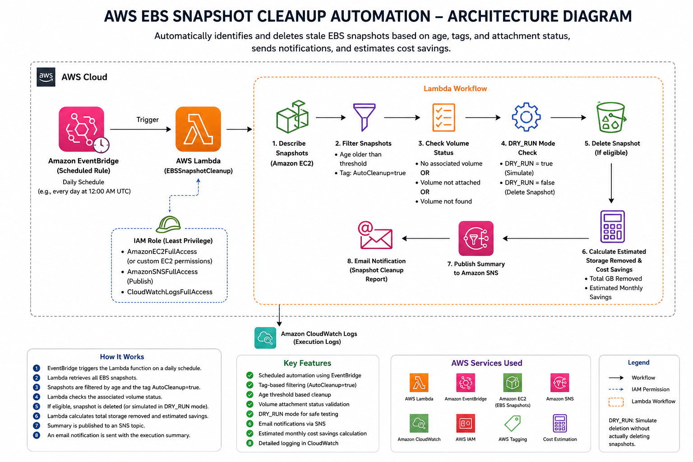
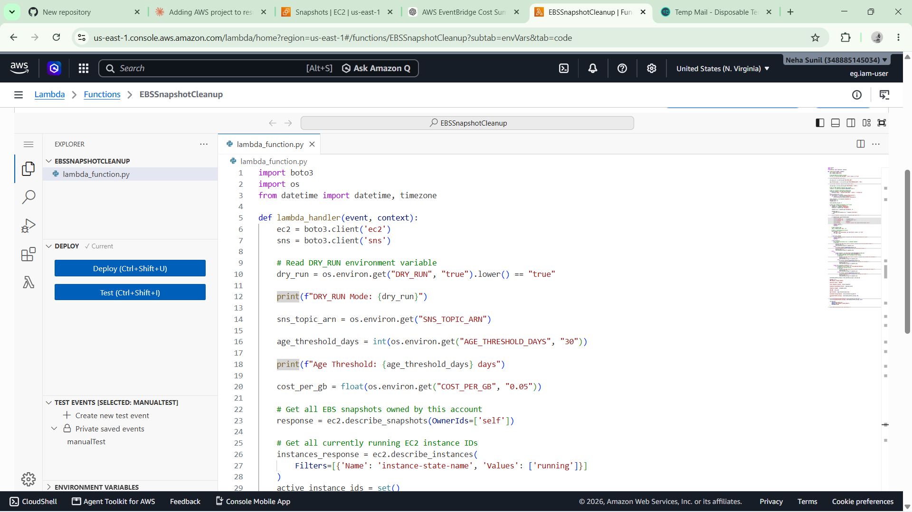
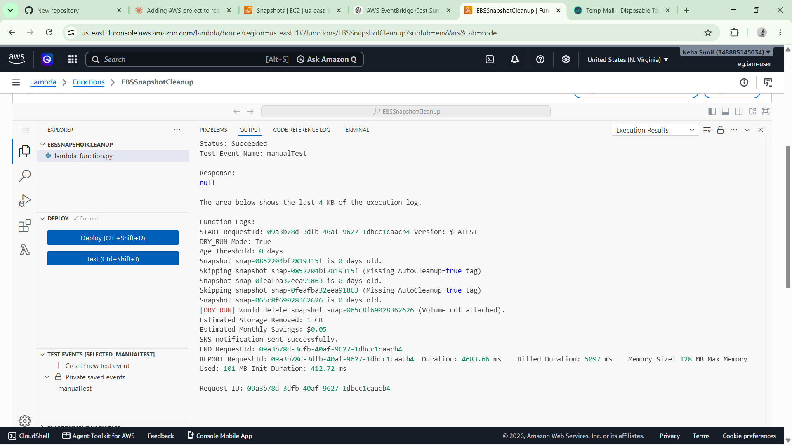
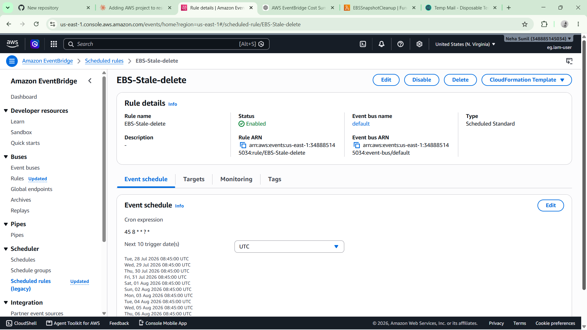
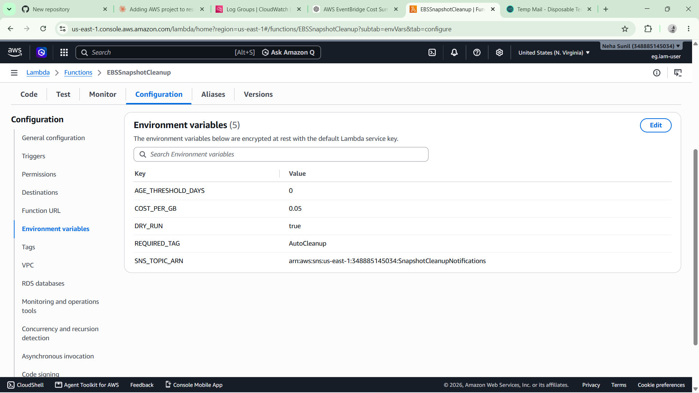
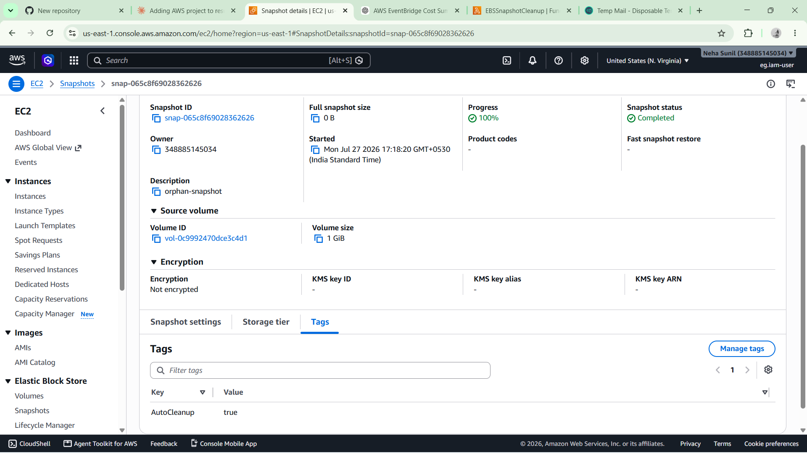
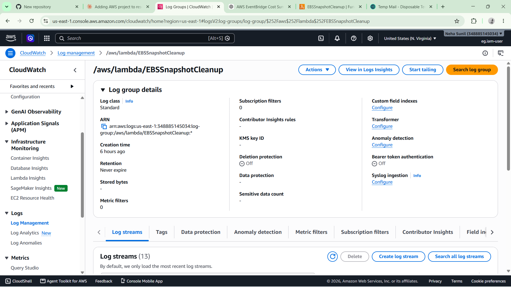
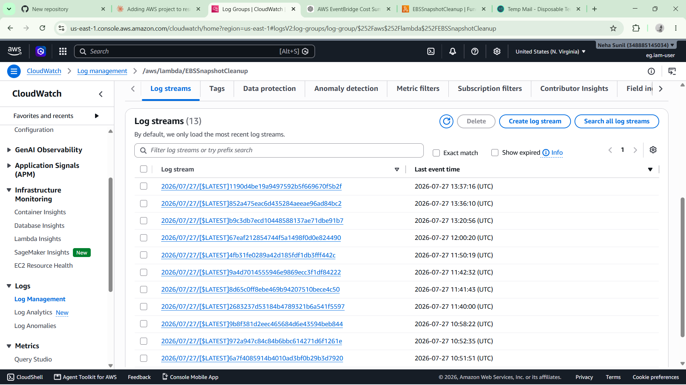
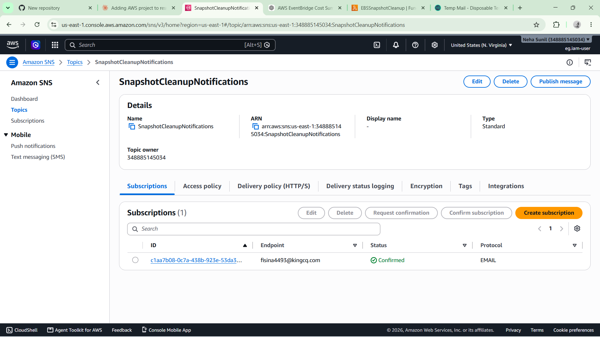
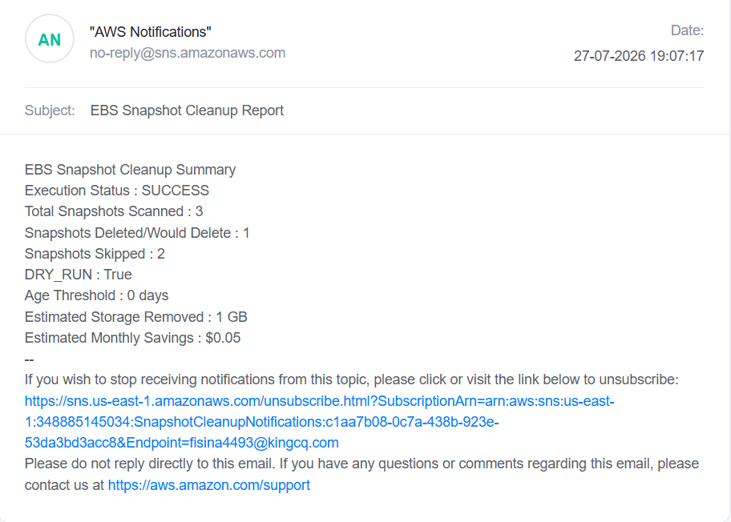

# 🚀 # AWS-EBS-Snapshot-Cleanup-Automation


Automatically identifies and cleans up **stale Amazon EBS snapshots** using **AWS Lambda**, **Amazon EventBridge**, and **Amazon EC2**.

The solution safely deletes only tagged snapshots older than a configurable number of days, supports **DRY_RUN** mode for safe testing, estimates potential monthly storage cost savings, and sends execution reports via **Amazon SNS**.

---

# 📌 Project Overview

Amazon EBS snapshots often accumulate over time due to:

- Deleted EC2 instances
- Deleted EBS volumes
- Manual backups that are never removed
- Forgotten snapshots created during testing

These unused snapshots continue consuming storage and can gradually increase AWS costs.

This project automates the cleanup process using a **fully serverless AWS architecture**.

---

# ✨ Features

- ✅ Serverless architecture using AWS Lambda
- ✅ Automated daily execution with EventBridge
- ✅ Tag-based snapshot filtering (`AutoCleanup=true`)
- ✅ Age-based cleanup using configurable thresholds
- ✅ DRY_RUN mode for safe testing
- ✅ Environment variable configuration
- ✅ Amazon SNS email notifications
- ✅ CloudWatch execution logging
- ✅ Estimated monthly storage cost savings
- ✅ Least-privilege IAM permissions

---

# 🏗️ Architecture

<p align="center">

</p>

---

# ☁️ AWS Services Used

| AWS Service | Purpose |
|--------------|----------|
| AWS Lambda | Executes snapshot cleanup automation |
| Amazon EventBridge | Schedules daily execution |
| Amazon EC2 | Retrieves instance, volume and snapshot information |
| Amazon EBS | Stores snapshots being managed |
| Amazon SNS | Sends email notifications |
| Amazon CloudWatch | Stores execution logs |
| AWS IAM | Provides secure permissions |

---

# 🔄 Workflow

```text
EventBridge
      │
      ▼
Lambda Function
      │
      ▼
Retrieve EBS Snapshots
      │
      ▼
Check Snapshot Age
      │
      ▼
Age > Threshold?
      │
 No ─────────► Skip
      │
     Yes
      │
      ▼
AutoCleanup=true Tag?
      │
 No ─────────► Skip
      │
     Yes
      │
      ▼
Volume Exists?
      │
      ▼
Delete Snapshot
(or DRY_RUN)
      │
      ▼
Estimate Monthly Savings
      │
      ▼
Publish SNS Notification
      │
      ▼
CloudWatch Logs
```

---

# ⚙️ Environment Variables

| Variable | Description | Example |
|----------|-------------|----------|
| `DRY_RUN` | Enables safe testing mode | `true` |
| `AGE_THRESHOLD_DAYS` | Minimum snapshot age before deletion | `30` |
| `SNS_TOPIC_ARN` | SNS Topic ARN | `arn:aws:sns:...` |
| `COST_PER_GB` | Estimated storage cost per GB/month | `0.05` |

---

# 📂 Repository Structure

```text
aws-ebs-snapshot-cleanup-automation/
│
├── screenshots/
│   ├── architecture-diagram.png
│   ├── lambda-function.png
│   ├── lambda-function-output.png
│   ├── eventbridge-rule.png
│   ├── environment-variables.png
│   ├── tagged-snapshot.png
│   ├── cloudwatch-logs.png
│   ├── cloudwatch-logs-2.png
│   ├── email-notification.png
│   └── sns-topic.png
│
├── lambda_function.py
├── requirements.txt
├── LICENSE
└── README.md
```

---

# 🛠️ Setup & Deployment

## 1️⃣ Clone the Repository

```bash
git clone https://github.com/Neha-V-M/AWS-EBS-Snapshot-Cleanup-Automation.git
```

---

## 2️⃣ Create IAM Role

Grant the Lambda function permissions to:

- Describe snapshots
- Describe volumes
- Describe instances
- Delete snapshots
- Publish to Amazon SNS
- Write CloudWatch Logs

---

## 3️⃣ Create Lambda Function

- Runtime: **Python 3.14**
- Upload `lambda_function.py`
- Attach the IAM Role
- Configure Environment Variables

---

## 4️⃣ Configure Environment Variables

| Variable | Value |
|-----------|-------|
| DRY_RUN | true |
| AGE_THRESHOLD_DAYS | 30 |
| SNS_TOPIC_ARN | Your SNS Topic ARN |
| COST_PER_GB | 0.05 |

---

## 5️⃣ Create SNS Topic

- Create a Standard Topic
- Add an Email Subscription
- Confirm the subscription

---

## 6️⃣ Configure EventBridge

Schedule Expression:

```text
cron(45 8 * * ? *)
```

Runs daily at **2:15 PM IST**.

---

## 7️⃣ Test the Solution

- Invoke Lambda manually
- Verify CloudWatch Logs
- Verify Email Notification
- Disable DRY_RUN after testing

---

# 📧 Sample Email Notification

```text
Subject:
EBS Snapshot Cleanup Report

Execution Status : SUCCESS

Total Snapshots Scanned : 8

Snapshots Deleted/Would Delete : 3

Snapshots Skipped : 5

Estimated Storage Removed : 120 GB

Estimated Monthly Savings : $6.00

DRY_RUN : False

Age Threshold : 30 days
```

---

# 📸 Screenshots

## Lambda Function



---
## Lambda Function output



---

## EventBridge Rule



---

## Environment Variables



---

## Tagged Snapshot



---

## CloudWatch Logs



---

## CloudWatch Logs 2



---

## SNS Topic



---

## Email Notification



---

# 📚 Learning Outcomes

This project helped me gain practical experience with:

- AWS Lambda
- Amazon EventBridge
- Amazon EC2 & Amazon EBS
- Amazon SNS
- Amazon CloudWatch
- AWS IAM
- Boto3 SDK
- Python automation
- Serverless architecture
- Cloud cost optimization
- Event-driven workflows

---

# 🔮 Future Enhancements

- Infrastructure as Code using Terraform or AWS SAM
- Multi-region snapshot cleanup
- CloudWatch Dashboards
- AWS Cost Explorer integration
- Cross-account snapshot cleanup

---

# 📄 License

This project is licensed under the **MIT License**.

---

# 👩‍💻 Author

**Neha V M**

- GitHub: https://github.com/Neha-V-M
- LinkedIn: https://www.linkedin.com/in/neha-v-m-b49819343

---

⭐ If you found this project useful, consider giving it a **star**.
